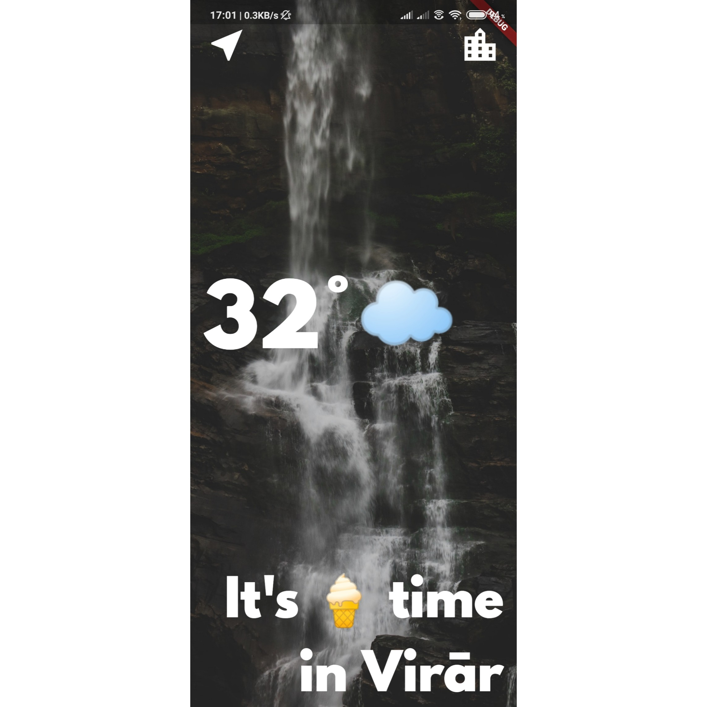
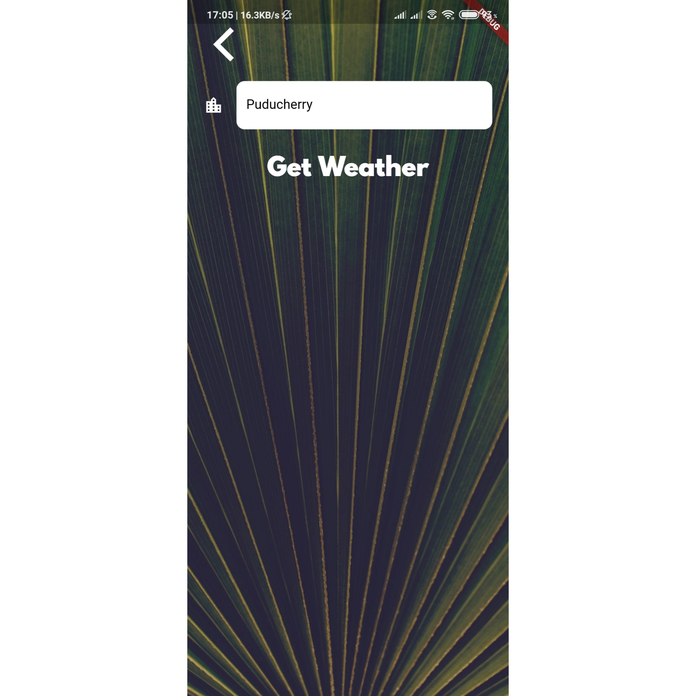
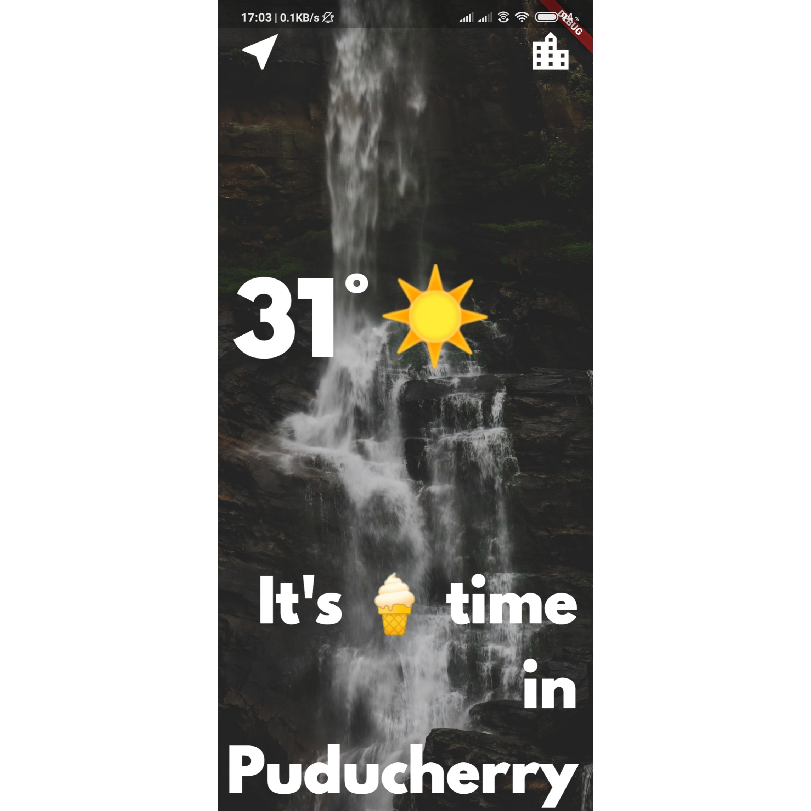

# CLIMA

A simple weather based Flutter application. This app is made to carry out time consuming tasks such
as getting device location and networking to get live data from the Internet. You will be able to find
out live weather data in current location of device as well as weather for any other city you want to.
The app makes use of API from the openweathermap.org for collecting live data from Internet.

## Getting Started

1] This is the main screen of the application. It by default displays the weather details of your current location.

2] This is the search screen where you can search weather for any city you want to just by typing the city name.

3] This are the respective details of the particular city you've entered (For eg :- Puducherry)

## Some of the key features of the app are as follows :

-> Asynchronous programming in Dart.

-> Networking with Dart http package.

-> Using API to fetch data from the Internet.

-> JSON for parsing the data.

-> Exception handling in Dart.

-> Use of Geolocator package to get live location.

-> Textfield Widget to take user input.

